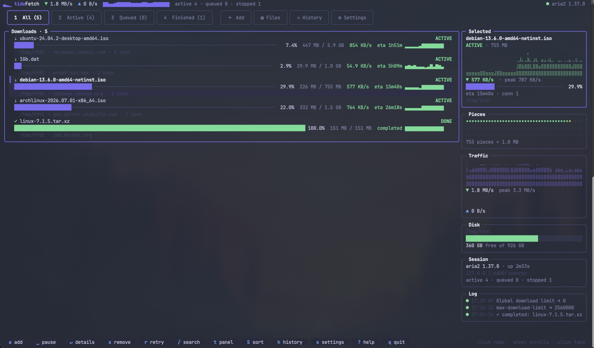
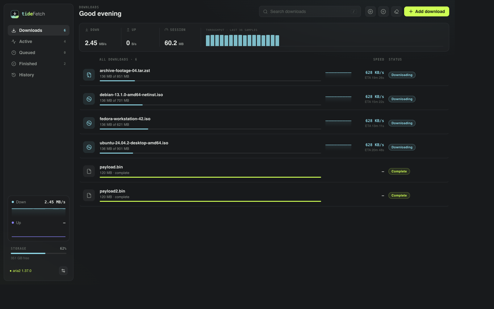

<div align="center">
  

  # tideFetch

  **A keyboard-first download manager for [aria2](https://aria2.github.io).**<br />
  A polished terminal UI for your own machine, plus a self-hosted web UI for headless servers and homelabs.

  [](https://github.com/Thre4dripper/tidefetch/actions/workflows/ci.yml)
  [](https://github.com/Thre4dripper/tidefetch/releases/latest)
  [](LICENSE)
  [](https://github.com/Thre4dripper/tidefetch/pkgs/container/tidefetch)

  [Website](https://thre4dripper.github.io/tidefetch/) ·
  [Documentation](https://thre4dripper.github.io/tidefetch/docs/getting-started) ·
  [Install](https://thre4dripper.github.io/tidefetch/docs/installation) ·
  [Releases](https://github.com/Thre4dripper/tidefetch/releases)
</div>



Tidefetch wraps the fast, protocol-rich aria2 engine in one Go binary. Run
`tidefetch` for an interactive TUI, or run `tidefetch serve` when the download
box lives elsewhere and you want to manage it from a browser.

## ✨ Why Tidefetch?

- **Built for the terminal** — keyboard-first navigation, full mouse support,
  live braille graphs, piece maps, disk telemetry and a built-in file browser.
- **Every aria2 protocol** — HTTP(S), FTP, SFTP, BitTorrent, Metalink, magnets
  and multi-mirror downloads.
- **Complete queue control** — add, inspect, pause, retry, reorder, remove,
  select torrent files and tune per-download or global options.
- **Persistent workflow** — sessions survive restarts, and categorized history
  makes completed downloads easy to find and run again.
- **A real web interface** — WebSocket updates, virtualized lists, responsive
  controls, bcrypt authentication and strict browser security headers.
- **Small and self-hostable** — native binaries, multi-architecture containers,
  Docker Compose, Helm, Kubernetes and Unraid assets.

## 🚀 Quick Install

**macOS and Linux**

```sh
curl -fsSL https://thre4dripper.github.io/tidefetch/install.sh | sh
```

**Windows**

```powershell
irm https://thre4dripper.github.io/tidefetch/install.ps1 | iex
```

The installer detects your OS and CPU, downloads the matching release,
verifies its SHA-256 checksum and places `tidefetch` on your `PATH`. The Windows
installer also installs aria2 when needed.

Prefer Homebrew?

```sh
brew install thre4dripper/tap/tidefetch
```

Then verify everything is wired up:

```sh
tidefetch doctor
```

See the full [installation guide](https://thre4dripper.github.io/tidefetch/docs/installation)
for upgrades, manual downloads, checksums and source builds.

## ⌨️ Use the TUI

```sh
tidefetch                                      # open the terminal UI
tidefetch https://example.com/archive.iso      # add a URL immediately
tidefetch "magnet:?xt=urn:btih:..."            # magnets work too
tidefetch doctor                               # diagnose configuration and RPC
```

Tidefetch can attach to an existing aria2 RPC endpoint or spawn and manage a
local daemon. Press `?` in the app for the complete keyboard and mouse guide.

## 🌐 Run the Web UI



For a local browser session:

```sh
tidefetch serve
# http://127.0.0.1:8210
```

For an all-in-one server deployment, the container bundles aria2:

```sh
docker run -d \
  --name tidefetch \
  --restart unless-stopped \
  -p 8210:8210 \
  -e TIDEFETCH_PASSWORD='replace-this-password' \
  -v tidefetch-config:/config \
  -v /srv/downloads:/downloads \
  ghcr.io/thre4dripper/tidefetch:latest
```

The image is multi-architecture (`amd64` and `arm64`); Docker selects the
correct build automatically.

Deployment guides: [Docker & Podman](https://thre4dripper.github.io/tidefetch/docs/deployment/docker) ·
[Kubernetes & k3s](https://thre4dripper.github.io/tidefetch/docs/deployment/kubernetes) ·
[Unraid](https://thre4dripper.github.io/tidefetch/docs/deployment/unraid) ·
[Reverse proxy & TLS](https://thre4dripper.github.io/tidefetch/docs/reverse-proxy)

## 🧭 Two Interfaces, One Queue

| Terminal UI | Web UI |
| --- | --- |
| Best for desktops, SSH and tmux | Best for NAS boxes, VPS hosts and homelabs |
| Starts with `tidefetch` | Starts with `tidefetch serve` |
| Keyboard and mouse driven | Browser and touch friendly |
| Attaches to or spawns aria2 | Keeps aria2 credentials server-side |

Both interfaces control the same aria2 engine and expose the same downloads,
files, history and settings. Choose whichever screen is closest to you.

## 📚 Documentation

The README is the short tour. The product site contains the maintained,
searchable guides:

- [Getting started](https://thre4dripper.github.io/tidefetch/docs/getting-started)
- [Installation](https://thre4dripper.github.io/tidefetch/docs/installation)
- [Configuration and command flags](https://thre4dripper.github.io/tidefetch/docs/configuration)
- [Data and persistence](https://thre4dripper.github.io/tidefetch/docs/data-and-persistence)
- [Homelab operations](https://thre4dripper.github.io/tidefetch/docs/homelab)
- [Troubleshooting](https://thre4dripper.github.io/tidefetch/docs/troubleshooting)

## 🧩 Go RPC Client

The UI-independent [`pkg/aria2`](pkg/aria2) package exposes aria2's JSON-RPC
methods and WebSocket notifications for other Go programs:

```go
import "github.com/Thre4dripper/tidefetch/pkg/aria2"

client, err := aria2.Dial(ctx, "ws://127.0.0.1:6800/jsonrpc", "secret")
```

## 🛠️ Development

```sh
make build      # embedded web UI + Go binary
make test       # unit and aria2 integration tests
make site       # type-check and build the product site
make docker     # local container image
```

The main code lives under `cmd/`, `internal/` and `pkg/`; `web/` is the
embedded dashboard, while `site/` is the independently deployed product and
documentation site.

## 📄 License

Tidefetch is available under the [MIT License](LICENSE). aria2 is a separate
GPL-2.0-or-later project; Tidefetch communicates with it over JSON-RPC and does
not link against it. Container images install aria2 from Alpine's package
repository and retain its licensing information.

---

<div align="center">
  Independent project powered by aria2 — not affiliated with the aria2 project.
</div>
